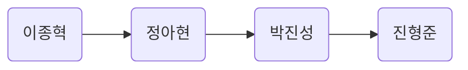

# hands-on-linux

## 진행방식

- 당일 진도범위, 진행자를 결정한다(로테이션).
- 모두 진도범위를 끝낼때까지 공부를 한다. (단, 상황을 보고 일찍 끝낼 수 있다.)
- 진행자는 공부가 끝나면 정리한 내용(`markdown`)을 <u>화면공유하며 설명</u>한다.
- 진행자는 정리한 내용을 새로운 `branch`로 만들고 `main`으로 PR을 올린다.
- 진행자가 아닌 나머지 인원은 다음시간 전까지 PR 내용을 리뷰한다.
- 진행자는 다음발표 전까지 PR을 `main`으로 merge한다.

<br>

## 진행시간
수요일, 일요일 오후 `8시 30분`

```
시작 날짜: 2023-01-11
종료 날짜:
```

<br>

## 진행 순서



<br>

## 목차
### [CHAPTER 1 리눅스 기본 조작법](https://github.com/Robot-Vision-LAB/hands-on-linux/blob/main/chapter01/README.md)
### CHAPTER 2 파일 다루기
### CHAPTER 3 프로그램 관리하기
### CHAPTER 4 사용자·시스템 정보 표시, 변경하기
### CHAPTER 5 파일 다루기 고급편
### CHAPTER 6 편리한 명령어 사용법
### CHAPTER 7 셸과 셸 스크립트 능숙하게 다루기
### CHAPTER 8 사용자와 시스템 관리하기
### CHAPTER 9 네트워크 능숙하게 다루기
### CHAPTER 10 파일 시스템 능숙하게 다루기
### CHAPTER 11 패키지 설치하기
### 부록 emacs, vi 에디터와 부트로더
