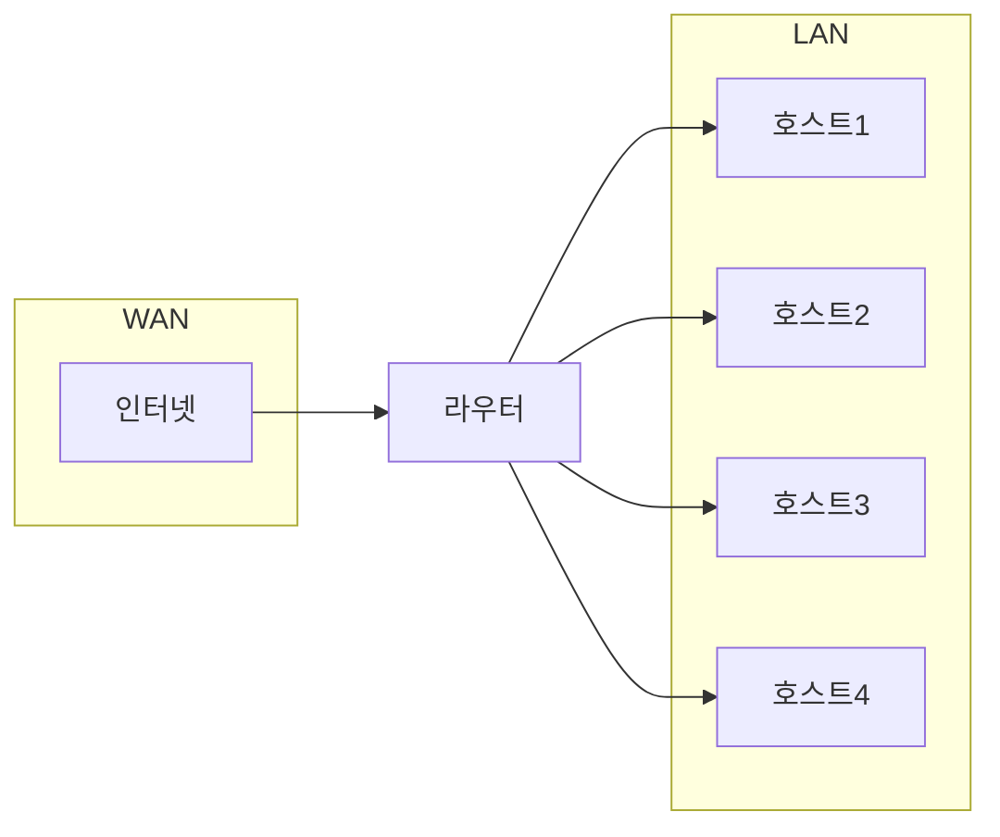

# 리눅스에서 네트워크 접속하기

```mermaid
graph LR
    
    
    C1[호스트1]
    C2[호스트2]
    C3[호스트3]
    C4[호스트4]

    subgraph WAN
        A[인터넷]
    end

    A --> B
    B[라우터]
    B --> C1
    B --> C2
    B --> C3
    B --> C4

    subgraph LAN
    C1[호스트1]
    C2[호스트2]
    C3[호스트3]
    C4[호스트4]
    end

```
